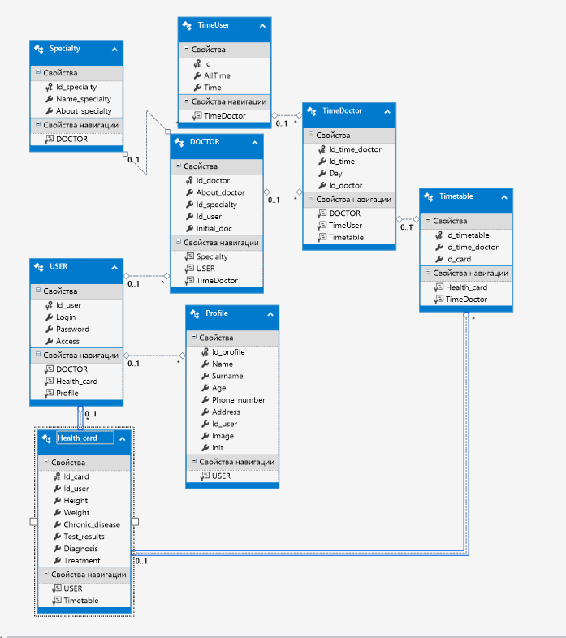

## Clinic 
  The software product was created using the `С# `language. Used api `WPF` with extensible markup language `XAML`. The `ADO.NET` technology was used to work with the database `MS SQL`.

  The software product has the following functionality: registration and authorization by role; viewing existing doctor records; viewing the schedule; viewing and changing medical cards; making an appointment.
  
  To work with already registered users in the file "КУРСОВОЙ.txt" logins, passwords and initial information are indicated.
  
  Database schema
  
  

